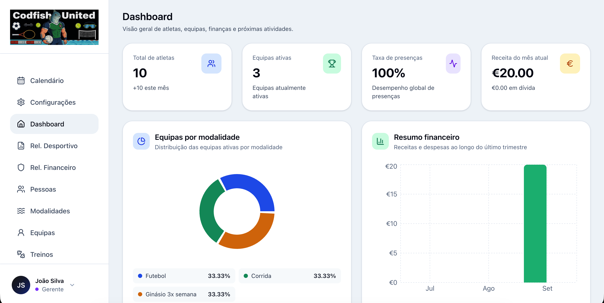
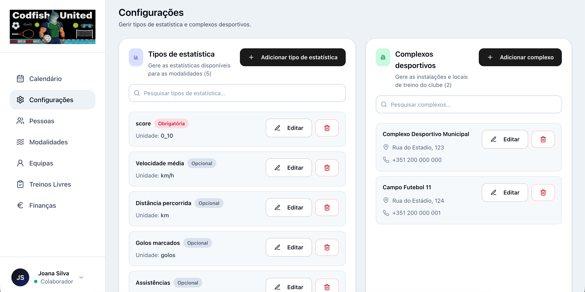
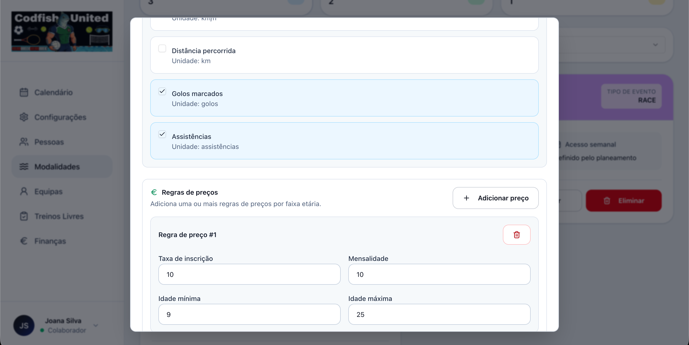
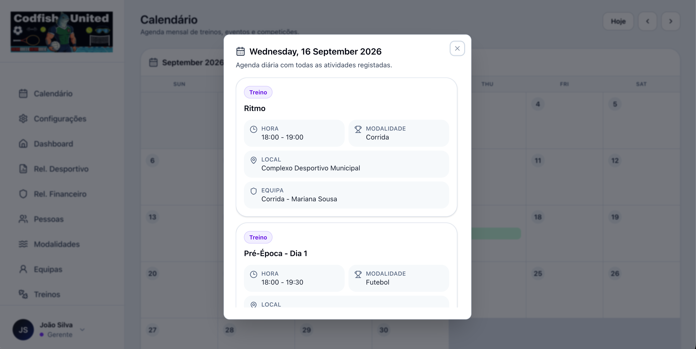
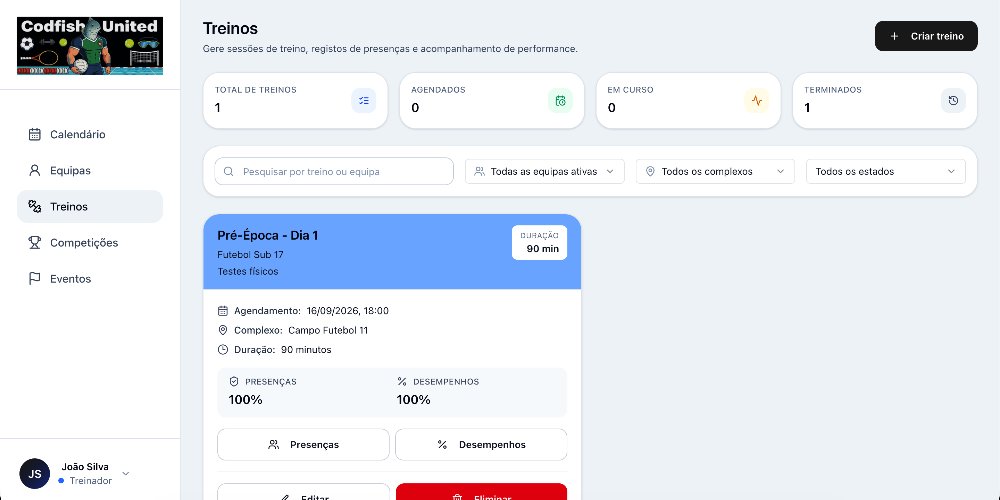
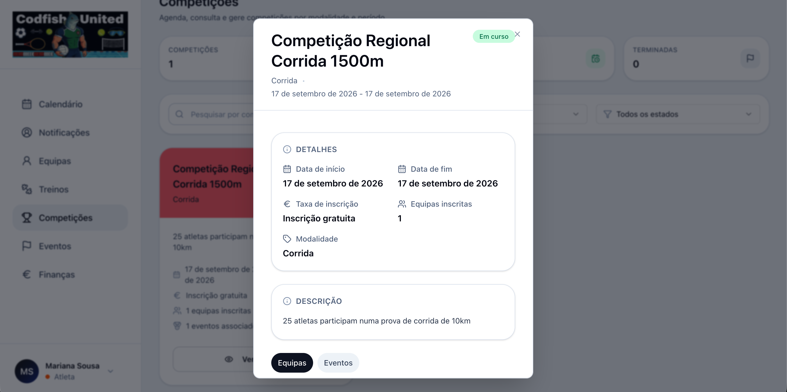
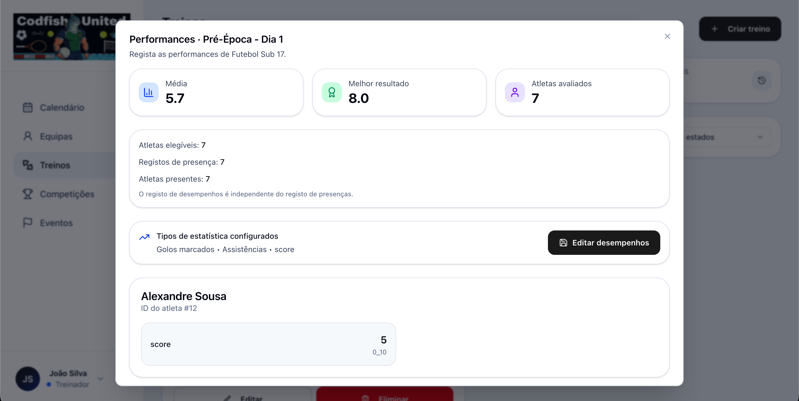
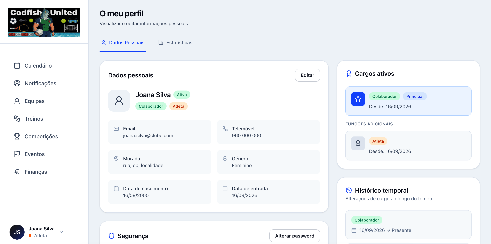
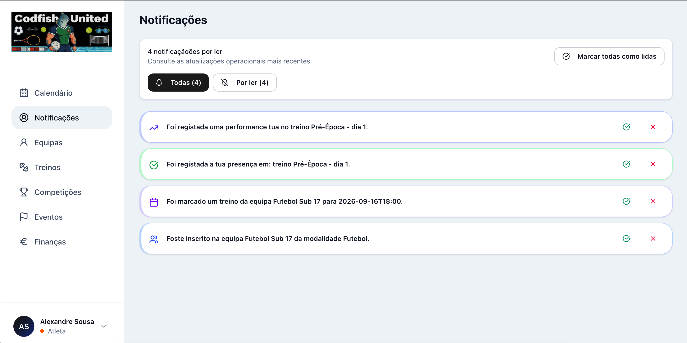
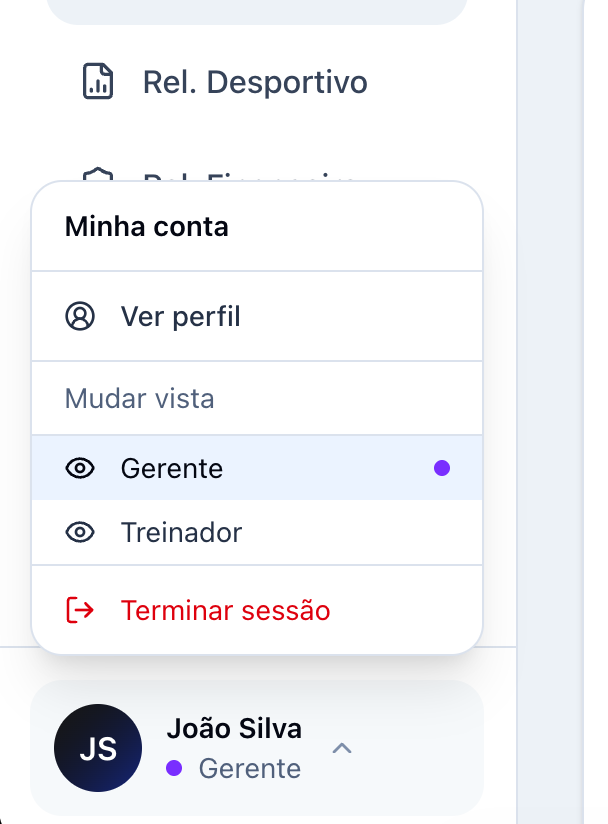

# Sports Club Full-Stack Platform

A configurable full-stack platform for managing sports clubs across multiple modalities. It supports role-specific workflows for athletes, coaches, staff, and managers, covering sports operations, attendance and performance tracking, membership fees, payment records, dashboards, and reports.

> **Live demo availability:** The application depends on independently deployed frontend and backend services. After approximately 15 minutes without requests, the backend may enter an inactive state. During the subsequent startup period, the application may appear blank or unavailable. Please wait approximately one minute and refresh the page. This is a limitation of the academic deployment environment.

> Academic group project developed during the 2025/2026 academic year at the University of Minho. See [Team](#team) for authorship details.

## Key features

- Configurable club setup: sports modalities, sports complexes, statistic types, and modality-specific settings
- Identity and access management for athletes, coaches, staff, and managers
- JWT-based authentication, refresh-token support, logout, token invalidation, route protection, and role-based access control
- Team and membership management with temporal links between people and teams
- Calendar management for training sessions, events, and competitions
- Attendance registration and athlete performance tracking
- Membership-fee, payment-record, and financial-management workflows
- Payment domain designed for future gateway integration, including mock payment flows and webhook-oriented endpoints
- Financial and sports analytics dashboards and reports

## Screenshots





















## Architecture

The project is a full-stack, three-tier application.

```text
Browser
  │
  ▼
React + TypeScript SPA
  │  HTTPS / REST
  ▼
Spring Boot REST API
  │  JPA / JDBC
  ▼
PostgreSQL
```

The frontend and backend are deployed independently. The academic deployment used Vercel for the frontend, Render for the API, and Supabase PostgreSQL for data persistence.

The backend is a structured monolith organised by seven functional subsystems: Identity, Sportscore, Teams, Activities, Activity Tracking, Finance, and Analytics.

### Frontend

The React application follows a feature-oriented structure. Each business feature groups API calls, UI components, hooks, models, and pages, while shared infrastructure and UI primitives live in dedicated cross-cutting modules.

### Backend

The Spring Boot API keeps application, domain, API, persistence, and service responsibilities close to each subsystem. Controllers expose DTO-based contracts; services enforce business rules; repositories encapsulate persistence; security is applied at the API boundary.

## Technology stack

| Area              | Technologies                                                                   |
| ----------------- | ------------------------------------------------------------------------------ |
| Frontend          | React, TypeScript, Vite, Tailwind CSS, TanStack Query, React Router            |
| Backend           | Java 21, Spring Boot, Spring Web, Spring Data JPA, Spring Security, JWT, Maven |
| Database          | PostgreSQL                                                                     |
| Local environment | Docker, Docker Compose                                                         |
| Deployment        | Vercel, Render, Supabase                                                       |

## Repository structure

```text
sports-club-fullstack/
├── frontend/                 # React SPA
│   ├── README.md             # Frontend-specific documentation
│   └── Dockerfile
├── backend/                  # Spring Boot REST API
│   ├── README.md             # Backend-specific documentation
│   └── Dockerfile
├── docs/                     # Architecture diagrams, screenshots, and project documentation
├── docker-compose.yml        # Local full-stack environment
├── .env.example              # Environment-variable template
├── .gitignore
└── README.md
```

## Run locally with Docker

### Prerequisites

- Docker Engine with Docker Compose v2

### 1. Create local configuration

Copy the environment template:

```bash
cp .env.example .env
```

### 2. Build and start the full stack

```bash
docker compose up --build
```

The first startup creates the local PostgreSQL database and lets Hibernate create or update the local schema.

Once all services are ready:

- Frontend: `http://localhost:3000`
- Backend API: `http://localhost:8080`
- Health endpoint: `http://localhost:8080/actuator/health`

### Stop the stack

Stop containers while keeping local PostgreSQL data:

```bash
docker compose down
```

Stop containers and remove the local database volume:

```bash
docker compose down -v
```

## API and domain invariants

The API follows an API-first, DTO-only contract:

- Request DTOs contain editable fields and validation rules; response DTOs contain identifiers, computed data, and read-only metadata.
- The acting user is inferred from the authenticated security context rather than accepted as a client-supplied actor field.
- Enumerated states such as roles, fee states, and payment states are validated at the API boundary and constrained in the database where possible.
- SS7 Analytics is read-only and aggregates data owned by other subsystems.
- Domain violations are translated into stable HTTP 4xx responses.

Important domain constraints include:

- A presence belongs to exactly one context: a training or an event, never both.
- A performance record follows the same training-or-event context rule.
- Team/person links are temporal.
- Attendance and performance registration use upsert semantics where the domain defines one logical record.
- Fee and payment state transitions are explicit and authorised.

## Concurrency control

### Optimistic locking

Shared mutable records such as teams, activities, presences, performances, fees, and payments can be read by multiple users at once. Optimistic locking prevents a later update from silently overwriting a previous update.

In JPA, a version field can be used on the entity:

```java
@Entity
public class Payment {
    @Id
    @GeneratedValue
    private Long id;

    @Version
    private long version;
}
```

Hibernate effectively performs an update like:

```sql
UPDATE payment
SET status = ?, version = version + 1
WHERE id = ? AND version = ?;
```

If another transaction already updated the row, Hibernate raises an optimistic-lock exception. The API represents this as `409 Conflict`:

```json
{
  "code": "RESOURCE_VERSION_CONFLICT",
  "message": "The resource was modified by another user. Refresh the data and try again."
}
```

Optimistic locking prevents lost updates between concurrent writers. It is separate from idempotency, which prevents repeated commands such as duplicated payment webhooks from applying the same business effect more than once.

### Idempotency

Payment webhook processing stores the provider event identifier and uses a unique constraint to prevent repeated notifications from creating duplicate payments or repeating state transitions. The payment and fee update takes place within one transaction.

## Persistence and schema management

PostgreSQL is accessed through Spring Data JPA. Hibernate currently uses `ddl-auto=update` for local development. Flyway is included as a dependency and is prepared for future versioned migrations.

The data model uses relational integrity, foreign keys, enum-like states, audit timestamps, uniqueness constraints, and XOR/check invariants. The default PostgreSQL schema is `public`.

## Payment domain

The payment architecture separates the domain from the gateway through an adapter/port boundary. The academic implementation includes mock payment flows and webhook-oriented endpoints. The model supports future external gateway integration through payment attempts, external identifiers, asynchronous notifications, and transactional state updates.

## Authentication and sessions

The backend validates authentication and authorisation on protected requests. The security module contains JWT handling, authentication filters, user-details loading, refresh-token support, and token invalidation.

The frontend route layer provides navigation behaviour, while the API enforces access to protected resources. Analytics endpoints are read-only and use the authenticated context for user-specific views where applicable.

## Observability and errors

The application exposes health endpoints through Spring Boot Actuator. API errors are represented through consistent HTTP status codes and structured error responses. Application logs and security logs support diagnosis of authentication events, role changes, payment transitions, webhook processing, and optimistic-lock conflicts.

## Component documentation

For component-specific information, see:

- [Frontend documentation](frontend/README.md)
- [Backend documentation](backend/README.md)

## Team

- David Sousa e Silva
- João Rafael Martins da Costa
- Tomás Barroso Ramalhete
- Sandro José Rodrigues Coelho

## Project status

The payment model and API surface are prepared for external gateway integration, but a real payment provider is not configured in the academic deployment.
